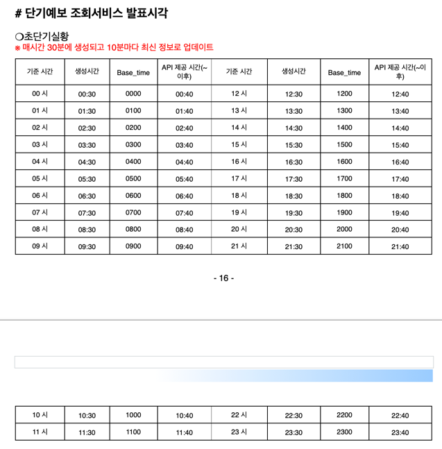
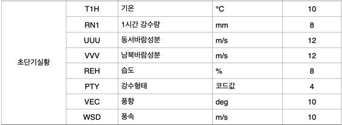
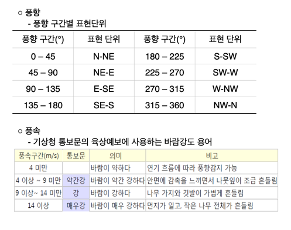

## 🌈기상청 단기예보 조회서비스

### 1. 초단기실황조회

**✔ 상세기능 설명**: 실황정보를 조회하기 위해 발표일자, 발표시각, 예보지점 X 좌표, 예보지점 Y 좌표의 조회 조건으로 자료구분코드, 실황값, 발표일자, 발표시각, 예보지점 X 좌표, 예보지점 Y 좌표의 정보를 조회하는 기능    

> #### ⭐️해당 "시각"의 정보 제공⭐️

**✔ ️갱신 시간**: 06시 발표(정시단위), 매시각 40분 이후 해당 시각의 API 호출 가능



**✔ ️제공 정보**:



- 하늘상태(SKY) 코드 : 맑음(1), 구름많음(3), 흐림(4)
- 강수형태(PTY) 코드 : (초단기) 없음(0), 비(1), 비/눈(2), 눈(3), 빗방울(5), 빗방울눈날림(6), 눈날림(7) 
                      (단기) 없음(0), 비(1), 비/눈(2), 눈(3), 소나기(4) 





**✔ ️예시**

```python
"items": {
                "item": [
                    {
                        "baseDate": "20220803",
                        "baseTime": "1100",
                        "category": "PTY",  # 강수형태
                        "nx": 60,
                        "ny": 127,
                        "obsrValue": "0"  # 없음 
                    },
                    {
                        "baseDate": "20220803",
                        "baseTime": "1100",
                        "category": "REH",  # 습도
                        "nx": 60,
                        "ny": 127,
                        "obsrValue": "93"  # 93%
                    },
                    {
                        "baseDate": "20220803",
                        "baseTime": "1100",
                        "category": "RN1",  # 1시간 강수량 
                        "nx": 60,
                        "ny": 127,
                        "obsrValue": "0"  # 0mm 
                    },
                    {
                        "baseDate": "20220803",
                        "baseTime": "1100",
                        "category": "T1H",  # 기온 
                        "nx": 60,
                        "ny": 127,
                        "obsrValue": "27.2"  # 27.2도
                    },
                    {
                        "baseDate": "20220803",
                        "baseTime": "1100",
                        "category": "UUU",  # 동서바람성분 
                        "nx": 60,
                        "ny": 127,
                        "obsrValue": "2"
                    },
                    {
                        "baseDate": "20220803",
                        "baseTime": "1100",
                        "category": "VEC",  # 풍향 
                        "nx": 60,
                        "ny": 127,
                        "obsrValue": "221"  # S - SW (남 - 남서풍)
                    },
                    {
                        "baseDate": "20220803",
                        "baseTime": "1100",
                        "category": "VVV",  # 남북바람성분 
                        "nx": 60,
                        "ny": 127,
                        "obsrValue": "2.3"
                    },
                    {
                        "baseDate": "20220803",
                        "baseTime": "1100",
                        "category": "WSD",  # 풍속
                        "nx": 60,
                        "ny": 127,
                        "obsrValue": "3"  # 바람이 약하다
                    }
                ]
            },
```