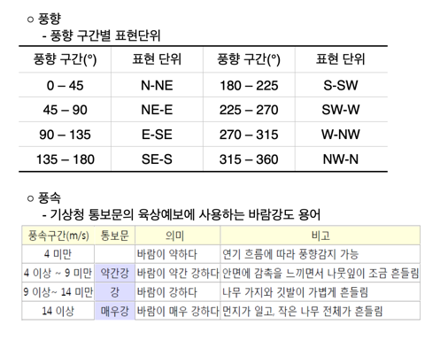

## 🌈기상청 단기예보 조회서비스

###2. 초단기예보조회

**✔ 상세기능 설명**: 초단기예보정보를 조회하기 위해 발표일자, 발표시각, 예보지점 X 좌표, 예보지점 Y 좌표의 조회 조건으로 자료구분코드, 예보값, 발표일자, 발표시각, 예보지점 X 좌표, 예보지점 Y 좌표의 정보를 조회하는 기능

> #### ⭐해당 시각으로부터 6시간 이내까지의 정보를 1시간 단위로 제공⭐️

**✔ ️갱신 시간**: 매시간 30분에 생성되고 10분마다 최신 정보로 업데이트(기온, 습도, 바람)


**✔ ️제공 정보**:


- 하늘상태(SKY) 코드 : 맑음(1), 구름많음(3), 흐림(4)
- 강수형태(PTY) 코드 : (초단기) 없음(0), 비(1), 비/눈(2), 눈(3), 빗방울(5), 빗방울눈날림(6), 눈날림(7) 
                      (단기) 없음(0), 비(1), 비/눈(2), 눈(3), 소나기(4) 
- 낙뢰(LGT) : 에너지밀도(0.2~100KA(킬로암페어)/㎢)




**✔ ️예시**

```python
{
    "response": {
        "header": {
            "resultCode": "00",
            "resultMsg": "NORMAL_SERVICE"
        },
        "body": {
            "dataType": "JSON",
            "items": {
                "item": [
                    {
                        "baseDate": "20220803",  # 발표 일자
                        "baseTime": "1230",  # 발표 시각
                        "category": "LGT",  # 낙뢰
                        "fcstDate": "20220803",  # 예측 일자
                        "fcstTime": "1300",  # 예측 시각 - 13시 (1시간 후)
                        "fcstValue": "0",
                        "nx": 60,
                        "ny": 127
                    },
                    {
                        "baseDate": "20220803",
                        "baseTime": "1230",
                        "category": "LGT",  # 낙뢰
                        "fcstDate": "20220803",
                        "fcstTime": "1400",  # 예측 시각 - 14시 (2시간 후)
                        "fcstValue": "0",
                        "nx": 60,
                        "ny": 127
                    },
                    {
                        "baseDate": "20220803",
                        "baseTime": "1230",
                        "category": "LGT",
                        "fcstDate": "20220803",
                        "fcstTime": "1500",  # 예측 시각 - 15시 (3시간 후)
                        "fcstValue": "0",
                        "nx": 60,
                        "ny": 127
                    },
                    {
                        "baseDate": "20220803",
                        "baseTime": "1230",
                        "category": "LGT",
                        "fcstDate": "20220803",
                        "fcstTime": "1600",  # 예측 시각 - 16시 (4시간 후)
                        "fcstValue": "0",
                        "nx": 60,
                        "ny": 127
                    },
                    {
                        "baseDate": "20220803",
                        "baseTime": "1230",
                        "category": "LGT",
                        "fcstDate": "20220803",
                        "fcstTime": "1700",  # 예측 시각 - 17시 (5시간 후)
                        "fcstValue": "0",
                        "nx": 60,
                        "ny": 127
                    },
                    {
                        "baseDate": "20220803",
                        "baseTime": "1230",
                        "category": "LGT",
                        "fcstDate": "20220803",
                        "fcstTime": "1800",  # 예측 시각 - 18시 (6시간 후)
                        "fcstValue": "0",
                        "nx": 60,
                        "ny": 127
                    },
                    {
                        "baseDate": "20220803",
                        "baseTime": "1230",
                        "category": "PTY",
                        "fcstDate": "20220803",
                        "fcstTime": "1300",
                        "fcstValue": "0",
                        "nx": 60,
                        "ny": 127
                    },
                    {
                        "baseDate": "20220803",
                        "baseTime": "1230",
                        "category": "PTY",
                        "fcstDate": "20220803",
                        "fcstTime": "1400",
                        "fcstValue": "0",
                        "nx": 60,
                        "ny": 127
                    },
                    {
                        "baseDate": "20220803",
                        "baseTime": "1230",
                        "category": "PTY",
                        "fcstDate": "20220803",
                        "fcstTime": "1500",
                        "fcstValue": "0",
                        "nx": 60,
                        "ny": 127
                    },
                    {
                        "baseDate": "20220803",
                        "baseTime": "1230",
                        "category": "PTY",
                        "fcstDate": "20220803",
                        "fcstTime": "1600",
                        "fcstValue": "0",
                        "nx": 60,
                        "ny": 127
                    },
                    {
                        "baseDate": "20220803",
                        "baseTime": "1230",
                        "category": "PTY",
                        "fcstDate": "20220803",
                        "fcstTime": "1700",
                        "fcstValue": "0",
                        "nx": 60,
                        "ny": 127
                    },
                    {
                        "baseDate": "20220803",
                        "baseTime": "1230",
                        "category": "PTY",
                        "fcstDate": "20220803",
                        "fcstTime": "1800",
                        "fcstValue": "0",
                        "nx": 60,
                        "ny": 127
                    },
                    {
                        "baseDate": "20220803",
                        "baseTime": "1230",
                        "category": "RN1",
                        "fcstDate": "20220803",
                        "fcstTime": "1300",
                        "fcstValue": "강수없음",
                        "nx": 60,
                        "ny": 127
                    },
                    {
                        "baseDate": "20220803",
                        "baseTime": "1230",
                        "category": "RN1",
                        "fcstDate": "20220803",
                        "fcstTime": "1400",
                        "fcstValue": "강수없음",
                        "nx": 60,
                        "ny": 127
                    },
                    {
                        "baseDate": "20220803",
                        "baseTime": "1230",
                        "category": "RN1",
                        "fcstDate": "20220803",
                        "fcstTime": "1500",
                        "fcstValue": "강수없음",
                        "nx": 60,
                        "ny": 127
                    },
                    {
                        "baseDate": "20220803",
                        "baseTime": "1230",
                        "category": "RN1",
                        "fcstDate": "20220803",
                        "fcstTime": "1600",
                        "fcstValue": "강수없음",
                        "nx": 60,
                        "ny": 127
                    },
                    {
                        "baseDate": "20220803",
                        "baseTime": "1230",
                        "category": "RN1",
                        "fcstDate": "20220803",
                        "fcstTime": "1700",
                        "fcstValue": "강수없음",
                        "nx": 60,
                        "ny": 127
                    },
                    {
                        "baseDate": "20220803",
                        "baseTime": "1230",
                        "category": "RN1",
                        "fcstDate": "20220803",
                        "fcstTime": "1800",
                        "fcstValue": "강수없음",
                        "nx": 60,
                        "ny": 127
                    },
                    {
                        "baseDate": "20220803",
                        "baseTime": "1230",
                        "category": "SKY",
                        "fcstDate": "20220803",
                        "fcstTime": "1300",
                        "fcstValue": "4",
                        "nx": 60,
                        "ny": 127
                    },
                    {
                        "baseDate": "20220803",
                        "baseTime": "1230",
                        "category": "SKY",
                        "fcstDate": "20220803",
                        "fcstTime": "1400",
                        "fcstValue": "4",
                        "nx": 60,
                        "ny": 127
                    },
                    {
                        "baseDate": "20220803",
                        "baseTime": "1230",
                        "category": "SKY",
                        "fcstDate": "20220803",
                        "fcstTime": "1500",
                        "fcstValue": "4",
                        "nx": 60,
                        "ny": 127
                    },
                    {
                        "baseDate": "20220803",
                        "baseTime": "1230",
                        "category": "SKY",
                        "fcstDate": "20220803",
                        "fcstTime": "1600",
                        "fcstValue": "4",
                        "nx": 60,
                        "ny": 127
                    },
                    {
                        "baseDate": "20220803",
                        "baseTime": "1230",
                        "category": "SKY",
                        "fcstDate": "20220803",
                        "fcstTime": "1700",
                        "fcstValue": "4",
                        "nx": 60,
                        "ny": 127
                    },
                    {
                        "baseDate": "20220803",
                        "baseTime": "1230",
                        "category": "SKY",
                        "fcstDate": "20220803",
                        "fcstTime": "1800",
                        "fcstValue": "4",
                        "nx": 60,
                        "ny": 127
                    },
                    {
                        "baseDate": "20220803",
                        "baseTime": "1230",
                        "category": "T1H",
                        "fcstDate": "20220803",
                        "fcstTime": "1300",
                        "fcstValue": "29",
                        "nx": 60,
                        "ny": 127
                    },
                    {
                        "baseDate": "20220803",
                        "baseTime": "1230",
                        "category": "T1H",
                        "fcstDate": "20220803",
                        "fcstTime": "1400",
                        "fcstValue": "29",
                        "nx": 60,
                        "ny": 127
                    },
                    {
                        "baseDate": "20220803",
                        "baseTime": "1230",
                        "category": "T1H",
                        "fcstDate": "20220803",
                        "fcstTime": "1500",
                        "fcstValue": "29",
                        "nx": 60,
                        "ny": 127
                    },
                    {
                        "baseDate": "20220803",
                        "baseTime": "1230",
                        "category": "T1H",
                        "fcstDate": "20220803",
                        "fcstTime": "1600",
                        "fcstValue": "30",
                        "nx": 60,
                        "ny": 127
                    },
                    {
                        "baseDate": "20220803",
                        "baseTime": "1230",
                        "category": "T1H",
                        "fcstDate": "20220803",
                        "fcstTime": "1700",
                        "fcstValue": "30",
                        "nx": 60,
                        "ny": 127
                    },
                    {
                        "baseDate": "20220803",
                        "baseTime": "1230",
                        "category": "T1H",
                        "fcstDate": "20220803",
                        "fcstTime": "1800",
                        "fcstValue": "29",
                        "nx": 60,
                        "ny": 127
                    },
                    {
                        "baseDate": "20220803",
                        "baseTime": "1230",
                        "category": "REH",
                        "fcstDate": "20220803",
                        "fcstTime": "1300",
                        "fcstValue": "85",
                        "nx": 60,
                        "ny": 127
                    },
                    {
                        "baseDate": "20220803",
                        "baseTime": "1230",
                        "category": "REH",
                        "fcstDate": "20220803",
                        "fcstTime": "1400",
                        "fcstValue": "85",
                        "nx": 60,
                        "ny": 127
                    },
                    {
                        "baseDate": "20220803",
                        "baseTime": "1230",
                        "category": "REH",
                        "fcstDate": "20220803",
                        "fcstTime": "1500",
                        "fcstValue": "75",
                        "nx": 60,
                        "ny": 127
                    },
                    {
                        "baseDate": "20220803",
                        "baseTime": "1230",
                        "category": "REH",
                        "fcstDate": "20220803",
                        "fcstTime": "1600",
                        "fcstValue": "80",
                        "nx": 60,
                        "ny": 127
                    },
                    {
                        "baseDate": "20220803",
                        "baseTime": "1230",
                        "category": "REH",
                        "fcstDate": "20220803",
                        "fcstTime": "1700",
                        "fcstValue": "80",
                        "nx": 60,
                        "ny": 127
                    },
                    {
                        "baseDate": "20220803",
                        "baseTime": "1230",
                        "category": "REH",
                        "fcstDate": "20220803",
                        "fcstTime": "1800",
                        "fcstValue": "80",
                        "nx": 60,
                        "ny": 127
                    },
                    {
                        "baseDate": "20220803",
                        "baseTime": "1230",
                        "category": "UUU",
                        "fcstDate": "20220803",
                        "fcstTime": "1300",
                        "fcstValue": "1.6",
                        "nx": 60,
                        "ny": 127
                    },
                    {
                        "baseDate": "20220803",
                        "baseTime": "1230",
                        "category": "UUU",
                        "fcstDate": "20220803",
                        "fcstTime": "1400",
                        "fcstValue": "2",
                        "nx": 60,
                        "ny": 127
                    },
                    {
                        "baseDate": "20220803",
                        "baseTime": "1230",
                        "category": "UUU",
                        "fcstDate": "20220803",
                        "fcstTime": "1500",
                        "fcstValue": "2.5",
                        "nx": 60,
                        "ny": 127
                    },
                    {
                        "baseDate": "20220803",
                        "baseTime": "1230",
                        "category": "UUU",
                        "fcstDate": "20220803",
                        "fcstTime": "1600",
                        "fcstValue": "3",
                        "nx": 60,
                        "ny": 127
                    },
                    {
                        "baseDate": "20220803",
                        "baseTime": "1230",
                        "category": "UUU",
                        "fcstDate": "20220803",
                        "fcstTime": "1700",
                        "fcstValue": "3.1",
                        "nx": 60,
                        "ny": 127
                    },
                    {
                        "baseDate": "20220803",
                        "baseTime": "1230",
                        "category": "UUU",
                        "fcstDate": "20220803",
                        "fcstTime": "1800",
                        "fcstValue": "2.8",
                        "nx": 60,
                        "ny": 127
                    },
                    {
                        "baseDate": "20220803",
                        "baseTime": "1230",
                        "category": "VVV",
                        "fcstDate": "20220803",
                        "fcstTime": "1300",
                        "fcstValue": "0.9",
                        "nx": 60,
                        "ny": 127
                    },
                    {
                        "baseDate": "20220803",
                        "baseTime": "1230",
                        "category": "VVV",
                        "fcstDate": "20220803",
                        "fcstTime": "1400",
                        "fcstValue": "0.9",
                        "nx": 60,
                        "ny": 127
                    },
                    {
                        "baseDate": "20220803",
                        "baseTime": "1230",
                        "category": "VVV",
                        "fcstDate": "20220803",
                        "fcstTime": "1500",
                        "fcstValue": "1.1",
                        "nx": 60,
                        "ny": 127
                    },
                    {
                        "baseDate": "20220803",
                        "baseTime": "1230",
                        "category": "VVV",
                        "fcstDate": "20220803",
                        "fcstTime": "1600",
                        "fcstValue": "1.2",
                        "nx": 60,
                        "ny": 127
                    },
                    {
                        "baseDate": "20220803",
                        "baseTime": "1230",
                        "category": "VVV",
                        "fcstDate": "20220803",
                        "fcstTime": "1700",
                        "fcstValue": "1.1",
                        "nx": 60,
                        "ny": 127
                    },
                    {
                        "baseDate": "20220803",
                        "baseTime": "1230",
                        "category": "VVV",
                        "fcstDate": "20220803",
                        "fcstTime": "1800",
                        "fcstValue": "1",
                        "nx": 60,
                        "ny": 127
                    },
                    {
                        "baseDate": "20220803",
                        "baseTime": "1230",
                        "category": "VEC",
                        "fcstDate": "20220803",
                        "fcstTime": "1300",
                        "fcstValue": "242",
                        "nx": 60,
                        "ny": 127
                    },
                    {
                        "baseDate": "20220803",
                        "baseTime": "1230",
                        "category": "VEC",
                        "fcstDate": "20220803",
                        "fcstTime": "1400",
                        "fcstValue": "245",
                        "nx": 60,
                        "ny": 127
                    },
                    {
                        "baseDate": "20220803",
                        "baseTime": "1230",
                        "category": "VEC",
                        "fcstDate": "20220803",
                        "fcstTime": "1500",
                        "fcstValue": "247",
                        "nx": 60,
                        "ny": 127
                    },
                    {
                        "baseDate": "20220803",
                        "baseTime": "1230",
                        "category": "VEC",
                        "fcstDate": "20220803",
                        "fcstTime": "1600",
                        "fcstValue": "249",
                        "nx": 60,
                        "ny": 127
                    },
                    {
                        "baseDate": "20220803",
                        "baseTime": "1230",
                        "category": "VEC",
                        "fcstDate": "20220803",
                        "fcstTime": "1700",
                        "fcstValue": "251",
                        "nx": 60,
                        "ny": 127
                    },
                    {
                        "baseDate": "20220803",
                        "baseTime": "1230",
                        "category": "VEC",
                        "fcstDate": "20220803",
                        "fcstTime": "1800",
                        "fcstValue": "250",
                        "nx": 60,
                        "ny": 127
                    },
                    {
                        "baseDate": "20220803",
                        "baseTime": "1230",
                        "category": "WSD",
                        "fcstDate": "20220803",
                        "fcstTime": "1300",
                        "fcstValue": "2",
                        "nx": 60,
                        "ny": 127
                    },
                    {
                        "baseDate": "20220803",
                        "baseTime": "1230",
                        "category": "WSD",
                        "fcstDate": "20220803",
                        "fcstTime": "1400",
                        "fcstValue": "2",
                        "nx": 60,
                        "ny": 127
                    },
                    {
                        "baseDate": "20220803",
                        "baseTime": "1230",
                        "category": "WSD",
                        "fcstDate": "20220803",
                        "fcstTime": "1500",
                        "fcstValue": "3",
                        "nx": 60,
                        "ny": 127
                    },
                    {
                        "baseDate": "20220803",
                        "baseTime": "1230",
                        "category": "WSD",
                        "fcstDate": "20220803",
                        "fcstTime": "1600",
                        "fcstValue": "3",
                        "nx": 60,
                        "ny": 127
                    },
                    {
                        "baseDate": "20220803",
                        "baseTime": "1230",
                        "category": "WSD",
                        "fcstDate": "20220803",
                        "fcstTime": "1700",
                        "fcstValue": "3",
                        "nx": 60,
                        "ny": 127
                    },
                    {
                        "baseDate": "20220803",
                        "baseTime": "1230",
                        "category": "WSD",
                        "fcstDate": "20220803",
                        "fcstTime": "1800",
                        "fcstValue": "3",
                        "nx": 60,
                        "ny": 127
                    }
                ]
            },
            "pageNo": 1,
            "numOfRows": 1000,
            "totalCount": 60
        }
    }
}
```