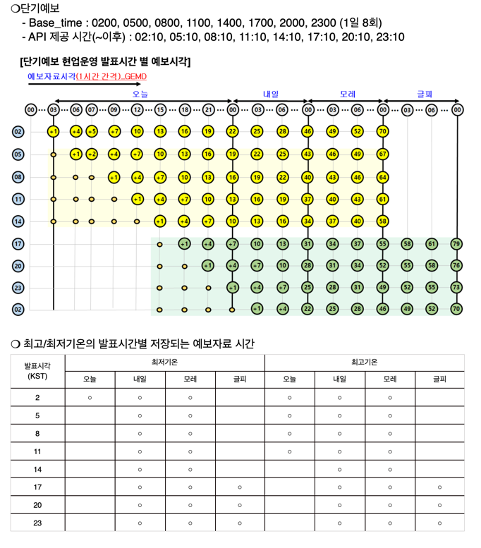
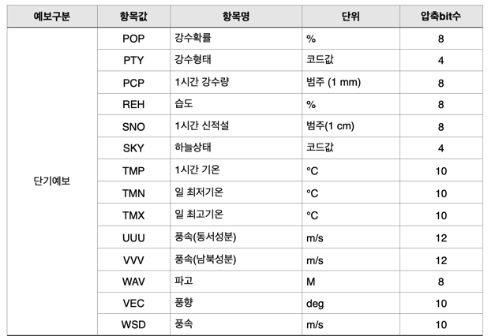
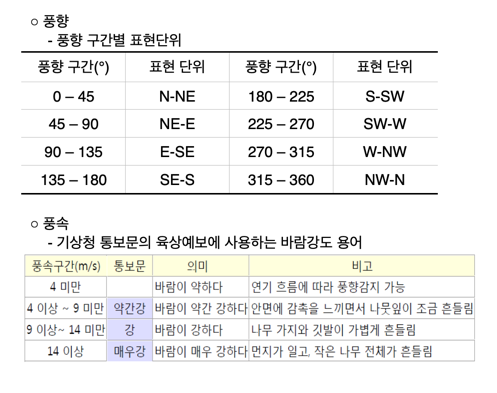

## 🌈기상청 단기예보 조회서비스

###3. 단기예보조회

**✔ 상세기능 설명**: 단기예보 정보를 조회하기 위해 발표일자, 발표시각, 예보지점 X좌표, 예보지점 Y 좌표의 조회 조건으로 발표일자, 발표시각, 자료구분문자, 예보 값, 예보일자, 예보시각, 예보지점 X 좌표, 예보지점 Y 좌표의 정보를 조회하는 기능

> #### ⭐해당 시각으로부터 3일 이내의 정보를 1시간 단위로 제공⭐️

**✔ ️갱신 시간**: Base_time을 기준으로 데이터가 갱신되며, Base_time 10분 이후부터 API제공   



**✔ ️제공 정보**:



- 하늘상태(SKY) 코드 : 맑음(1), 구름많음(3), 흐림(4)
- 강수형태(PTY) 코드 : (초단기) 없음(0), 비(1), 비/눈(2), 눈(3), 빗방울(5), 빗방울눈날림(6), 눈날림(7) 
                      (단기) 없음(0), 비(1), 비/눈(2), 눈(3), 소나기(4) 

✅ **일 최저기온(TMN)** 과 **일 최고기온(TMX)** 는 발표시간대별로 제공여부 판단해야함




**✔ ️예시**   
8/3일 낮 12시 기준 그 다음날인 8/4일 00시 (1시간만) 정보 예시

```python
                    {
                        "baseDate": "20220803",
                        "baseTime": "1100",
                        "category": "TMP",  # 1시간 기온
                        "fcstDate": "20220804",
                        "fcstTime": "0000",
                        "fcstValue": "27",  # 27도
                        "nx": 60,
                        "ny": 127
                    },
                    {
                        "baseDate": "20220803",
                        "baseTime": "1100",
                        "category": "UUU",   # 풍속(동서성분)
                        "fcstDate": "20220804",
                        "fcstTime": "0000",
                        "fcstValue": "0.8",
                        "nx": 60,
                        "ny": 127
                    },
                    {
                        "baseDate": "20220803",
                        "baseTime": "1100",
                        "category": "VVV",   # 풍속(남북성분)
                        "fcstDate": "20220804",
                        "fcstTime": "0000",
                        "fcstValue": "0.9",
                        "nx": 60,
                        "ny": 127
                    },
                    {
                        "baseDate": "20220803",
                        "baseTime": "1100",
                        "category": "VEC",  # 풍향
                        "fcstDate": "20220804",
                        "fcstTime": "0000",
                        "fcstValue": "222",
                        "nx": 60,
                        "ny": 127
                    },
                    {
                        "baseDate": "20220803",
                        "baseTime": "1100",
                        "category": "WSD",   # 풍속
                        "fcstDate": "20220804",
                        "fcstTime": "0000",
                        "fcstValue": "1.2",
                        "nx": 60,
                        "ny": 127
                    },
                    {
                        "baseDate": "20220803",
                        "baseTime": "1100",
                        "category": "SKY",   # 하늘상태
                        "fcstDate": "20220804",
                        "fcstTime": "0000",
                        "fcstValue": "4",  # 흐림
                        "nx": 60,
                        "ny": 127
                    },
                    {
                        "baseDate": "20220803",
                        "baseTime": "1100",
                        "category": "PTY",   # 강수형태
                        "fcstDate": "20220804",
                        "fcstTime": "0000",
                        "fcstValue": "0",  # 없음(0)
                        "nx": 60,
                        "ny": 127
                    },
                    {
                        "baseDate": "20220803",
                        "baseTime": "1100",
                        "category": "POP",   # 강수확률
                        "fcstDate": "20220804",
                        "fcstTime": "0000",
                        "fcstValue": "30",  # 30%
                        "nx": 60,
                        "ny": 127
                    },
                    {
                        "baseDate": "20220803",
                        "baseTime": "1100",
                        "category": "WAV",   # 파고
                        "fcstDate": "20220804",
                        "fcstTime": "0000",
                        "fcstValue": "0",
                        "nx": 60,
                        "ny": 127
                    },
                    {
                        "baseDate": "20220803",
                        "baseTime": "1100",
                        "category": "PCP",   # 1시간 강수량
                        "fcstDate": "20220804",
                        "fcstTime": "0000",
                        "fcstValue": "강수없음",
                        "nx": 60,
                        "ny": 127
                    },
                    {
                        "baseDate": "20220803",
                        "baseTime": "1100",
                        "category": "REH",   # 습도
                        "fcstDate": "20220804",
                        "fcstTime": "0000",
                        "fcstValue": "90",  # 90%
                        "nx": 60,
                        "ny": 127
                    },
                    {
                        "baseDate": "20220803",
                        "baseTime": "1100",
                        "category": "SNO",   # 1시간 신적설
                        "fcstDate": "20220804",
                        "fcstTime": "0000",
                        "fcstValue": "적설없음",
                        "nx": 60,
                        "ny": 127
                    },
```