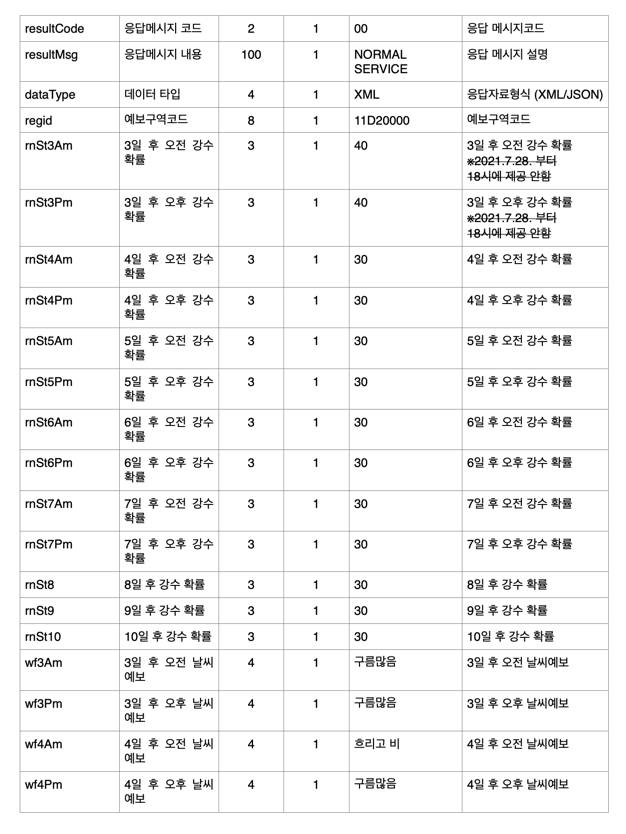
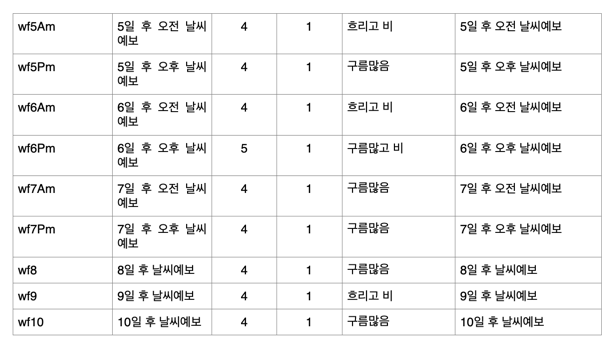

## 🌈기상청 중기예보 조회서비스

###2. 중기육상예보조회

**✔ 상세기능 설명**: 예보구역코드, 발표시각의 조회 조건으로 예보일로부터 3일에서 10일까지 육상날씨정보를 조회하는 기능

> #### ⭐예보일으로부터 3일에서 10일이내의 (강수확률)과 (날씨정보)를 오전/오후 단위로 제공⭐️

**✔ ️갱신 시간**: 일 2회(06:00,18:00)회 생성 되며 발표시각을 입력하면 됨, 최근 24시간 자료만 제공


**✔ ️제공 정보**:

- 강수확률
- 날씨정보





**✔ ️예시**   

```python
{
    "response": {
        "header": {
            "resultCode": "00",
            "resultMsg": "NORMAL_SERVICE"
        },
        "body": {
            "dataType": "JSON",
            "items": {
                "item": [
                    {
                        "regId": "11B00000",
                        "rnSt3Am": 90,  # 3일 후 오전 강수 확률
                        "rnSt3Pm": 90,  # 3일 후 오후 강수 확률
                        "rnSt4Am": 40,  # 4일 후 오전 강수 확률
                        "rnSt4Pm": 40,  # 4일 후 오후 강수 확률
                        "rnSt5Am": 40,  # 5일 후 오전 강수 확률
                        "rnSt5Pm": 90,  # 5일 후 오후 강수 확률
                        "rnSt6Am": 90,  # 6일 후 오전 강수 확률
                        "rnSt6Pm": 90,  # 6일 후 오후 강수 확률
                        "rnSt7Am": 40,  # 7일 후 오전 강수 확률
                        "rnSt7Pm": 40,  # 7일 후 오후 강수 확률
                        "rnSt8": 70,    # 8일 후 강수 확률
                        "rnSt9": 40,    # 9일 후 강수 확률
                        "rnSt10": 40,   # 10일 후 강수 확률
                        "wf3Am": "흐리고 비",  # 3일 후 오전 날씨예보
                        "wf3Pm": "흐리고 비",  # 3일 후 오후 날씨예보
                        "wf4Am": "흐림",      # 4일 후 오전 날씨예보
                        "wf4Pm": "흐림",      # 4일 후 오후 날씨예보
                        "wf5Am": "흐림",      # 5일 후 오전 날씨예보
                        "wf5Pm": "흐리고 비",  # 5일 후 오후 날씨예보
                        "wf6Am": "흐리고 비",  # 6일 후 오전 날씨예보
                        "wf6Pm": "흐리고 비",  # 6일 후 오후 날씨예보
                        "wf7Am": "흐림",      # 7일 후 오전 날씨예보
                        "wf7Pm": "흐림",      # 7일 후 오후 날씨예보
                        "wf8": "흐리고 비",    # 8일 후 날씨예보
                        "wf9": "흐림",        # 9일 후 날씨예보
                        "wf10": "흐림"        # 10일 후 날씨예보
                    }
                ]
            },
            "pageNo": 1,
            "numOfRows": 10,
            "totalCount": 1
        }
    }
}

```