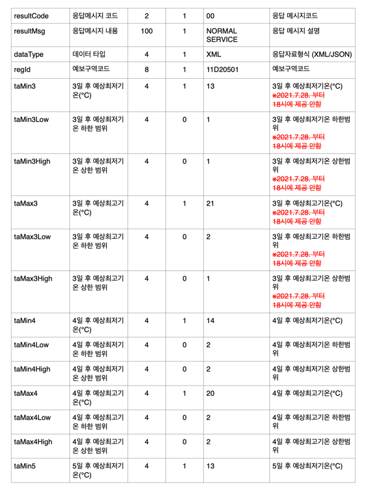
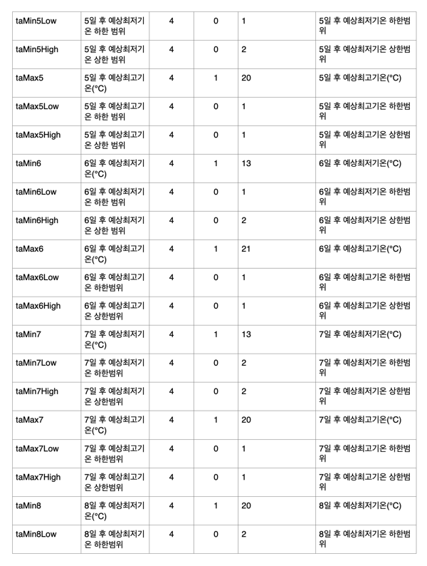
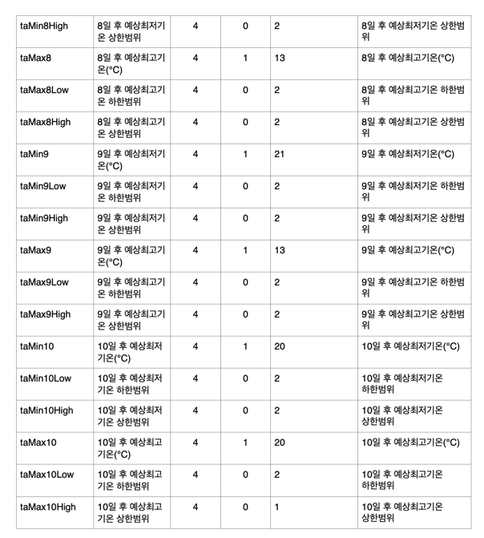

## 🌈기상청 중기예보 조회서비스

###3. 중기기온조회

**✔ 상세기능 설명**: 예보구역코드, 발표시각의 조회 조건으로 예보일로부터 3일에서 10일까지 최저/최고기온정보를  조회하는 기능`

> #### ⭐예보일으로부터 3일에서 10일이내의 최저/최고기온 정보를 제공⭐️

**✔ ️갱신 시간**: 일 2회(06:00,18:00)회 생성 되며 발표시각을 입력하면 됨, 최근 24시간 자료만 제공


**✔ ️제공 정보**:

- **n일 후 예상최저기온 (taMin)**
- **n일 후 예상최고기온 (taMax)**
- n일 후 예상최저기온 하한 범위
- n일 후 예상최저기온 상한 범위
- n일 후 예상최고기온 하한 범위
- n일 후 예상최고기온 상한 범위





**✔ ️예시**   

```python
{
    "response": {
        "header": {
            "resultCode": "00",
            "resultMsg": "NORMAL_SERVICE"
        },
        "body": {
            "dataType": "JSON",
            "items": {
                "item": [
                    {
                        "regId": "11B10101",
                        "taMin3": 26,
                        "taMin3Low": 1,
                        "taMin3High": 1,
                        "taMax3": 31,
                        "taMax3Low": 1,
                        "taMax3High": 1,
                        "taMin4": 26,
                        "taMin4Low": 0,
                        "taMin4High": 0,
                        "taMax4": 31,
                        "taMax4Low": 1,
                        "taMax4High": 1,
                        "taMin5": 26,
                        "taMin5Low": 0,
                        "taMin5High": 0,
                        "taMax5": 30,
                        "taMax5Low": 0,
                        "taMax5High": 1,
                        "taMin6": 26,
                        "taMin6Low": 1,
                        "taMin6High": 0,
                        "taMax6": 29,
                        "taMax6Low": 1,
                        "taMax6High": 1,
                        "taMin7": 25,
                        "taMin7Low": 1,
                        "taMin7High": 1,
                        "taMax7": 30,
                        "taMax7Low": 1,
                        "taMax7High": 1,
                        "taMin8": 25,
                        "taMin8Low": 0,
                        "taMin8High": 1,
                        "taMax8": 30,
                        "taMax8Low": 0,
                        "taMax8High": 1,
                        "taMin9": 25,
                        "taMin9Low": 0,
                        "taMin9High": 1,
                        "taMax9": 30,
                        "taMax9Low": 0,
                        "taMax9High": 1,
                        "taMin10": 24,
                        "taMin10Low": 0,
                        "taMin10High": 1,
                        "taMax10": 30,
                        "taMax10Low": 0,
                        "taMax10High": 1
                    }
                ]
            },
            "pageNo": 1,
            "numOfRows": 10,
            "totalCount": 1
        }
    }
}
```